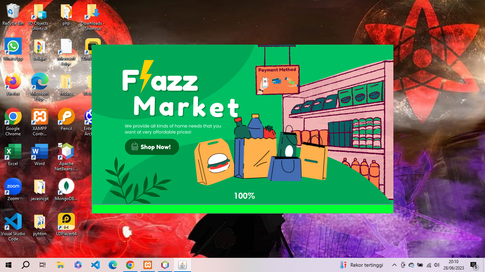

![Aplikasi Sistem manajemen supermarket]

Aplikasi  Sistem manajemen supermarket adalah sebuah sistem kasir (Point of Sales) dan manajemen produk supermarket.

## Daftar Isi
1. [Fitur](#fitur)
2. [Demo Aplikasi](#demo-aplikasi)
3. [Instalasi](#instalasi)
    - [Spesifikasi yang Dibutuhkan](#spesifikasi)
    - [Cara Install](#cara-install)
6. [Screenshots](#screenshots)
7. [Lisensi](#license)

## Fitur

Fitur pada Aplikasi ini meliputi:

1. Akun Login
    - Login dan Logout User
    - Ganti Password User
2. Entry Transaksi
    - Entry Transaksi Tunai
    - Pencarian Produk
    - Konfirmasi Transaksi
    - Cetak Nota (PDF; Format A4)
3. Manajemen Produk
    - List Produk
    - Cetak Daftar Harga
    - Input Produk Baru
    - Edit Produk (Harga Tunai dan Kredit)
    - Hapus Produk
4. Manajemen Satuan Produk
    - List Satuan Produk
    - Input Produk Baru
    - Edit Satuan Produk
    - Hapus Satuan Produk
5. Manajemen Transaksi
    - List Transaksi Hari ini
    - List Transaksi
    - Detail Transaksi
    - Cetak Nota (PDF; Format A4)
6. Laporan Penjualan
   
7. Manajemen kasir
    - List User
    - Input User Baru
    - Edit User
    - Hapus User (jika tidak ada transaksi)

### Spesifikasi
- Java jdk ^18
- Database MySQL
- Apache neatbeans
### Cara Install

1. Clone atau download source code
    - Para terminal, clone repo `git clone git@github.com:Anjaszz/Aplikasi-sistem-manajemen-super-market.git`
    - atau `git clone https://github.com/Anjaszz/Aplikasi-sistem-manajemen-super-market.git`
    - Jika tidak menggunakan Git, silakan **Download Zip**
2. Jalankan pada aplikasi Neatbeans
3. selesai

## Screenshots

#### Tampilan Loading

#### Konfirmasi Entry Transaksi

#### List Transaksi

#### Daftar Produk

#### Laporan Penjualan 

## Lisensi

Project Sistem Manajemen Supermarket merupakan software Point of Sales yang free dan open source di bawah [lisensi MIT](LICENSE).
